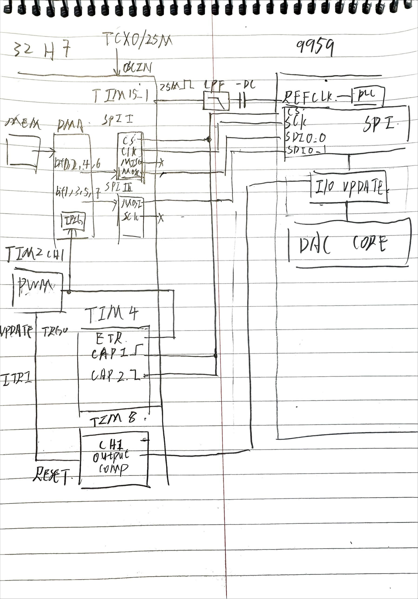
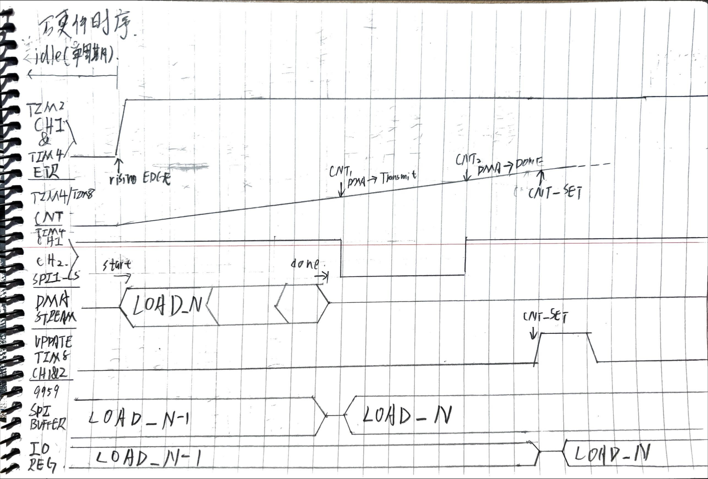

# STM32H723VGTx — AD9959 引脚对照表

> 来源：`DDS_9959_combd.ioc`，基于用户 GPIO_Label 备注整理。

## AD9959 接口

| STM32 引脚 | 信号功能    | GPIO_Label（用户备注）     | 外设复用                | 备注                                                                                                         |
| :--------: | :---------- | :------------------------- | :---------------------- | :----------------------------------------------------------------------------------------------------------- |
|    PA0    | TIM2_CH1    | `SPI_9959_DMA_TRIG`      | TIM2 CH1 PWM 输出       | TIM2_CH1 上升沿 → DMA 搬运数据到 SPI1+SPI3；TIM2 Update → TIM8 Reset (ITR1)；PA0 外部飞线到 PE0 (TIM4_ETR) |
|    PA15    | SPI1_NSS    | `SPI_9959_CS`            | SPI1 硬件 NSS           | AD9959 片选                                                                                                  |
|    PB3    | SPI1_SCK    | `SPI_9959_SCLK`          | SPI1 时钟               | AD9959 串行时钟 (SCLK)                                                                                       |
|    PB4    | SPI1_MISO   | `SPI_9959_IO2_R`         | SPI1 MISO               | AD9959 SDIO2 读回 (SDIO_2 READ)                                                                              |
|    PD7    | SPI1_MOSI   | `SPI_9959_DIO0`          | SPI1 MOSI               | SPI1 与 SPI3 并行发送，AD9959 SDIO0                                                                          |
|    PD6    | SPI3_MOSI   | `SPI_9959_DIO1`          | SPI3 MOSI (TX Only)     | SPI1 与 SPI3 并行发送，AD9959 SDIO1                                                                          |
|    PD5    | GPIO_Output | `IO_9959_DIO2`           | GPIO 输出               | AD9959 SDIO2 (写方向与 SPI1/SPI3 同步翻转)                                                                   |
|    PC7    | TIM8_CH2    | `SPI_9959_DIO3`          | TIM8 CH2 Output Compare | AD9959 SDIO3 (写方向与 SPI1/SPI3 同步翻转)                                                                   |
|    PC6    | TIM8_CH1    | `SYNC_9959_IO_UPDATE`    | TIM8 CH1 Output Compare | AD9959 IO_UPDATE (同步更新信号)                                                                              |
|    PC12    | TIM15_CH1   | `REF_9959_CLK`           | TIM15 CH1 PWM 输出      | AD9959 REF_CLK (参考时钟)                                                                                    |
|    PB6    | TIM4_CH1    | `SPI_9959_CS_CAPTURE1`   | TIM4 CH1 Input Capture  | 直连 PA15 (SPI1_NSS)，捕获 CS 拉低时刻 → 得到 DMA 触发到 SPI 开始通信的延时                                 |
|    PB7    | TIM4_CH2    | `SPI_9959_CS_CAPTURE2`   | TIM4 CH2 Input Capture  | 直连 PA15 (SPI1_NSS)，捕获 CS 拉高时刻 → 得到 DMA 触发到 SPI 通信结束的延时                                 |
|    PE0    | TIM4_ETR    | *(无备注)*               | TIM4 外部触发输入       | **外部飞线直连 PA0 (TIM2_CH1)**，检测 TIM2_CH1 上升沿 → 获取 DMA 触发的精确时刻 (TIM4 复位起点)       |
|    PB8    | GPIO_Input  | `SYNC_9959_IO_UPDATE_BP` | GPIO 输入               | SYNC IO_UPDATE 回读 (Bypass)                                                                                 |

> **TIM4 时序测量原理**：PE0 外部连接 PA0，TIM4 ETR 检测 TIM2_CH1 的上升沿并复位 TIM4 计数器；PB6/PB7 直连 SPI1 硬件 NSS (PA15)，分别在 CS↓ 和 CS↑ 时捕获 TIM4 计数值。两次捕获值即为"触发 DMA → SPI 开始通信"和"触发 DMA → SPI 通信结束"的时间，用于计算 TIM8 IO_UPDATE 同步信号的延迟补偿。

## AD9959 辅助 IO

| STM32 引脚 | 信号功能    | GPIO_Label（用户备注） | 外设复用  | 备注          |
| :--------: | :---------- | :--------------------- | :-------- | :------------ |
|    PD0    | UART4_RX    | `IO_9959_3`          | UART4 RX  | UART 通信 IO3 |
|    PD1    | UART4_TX    | `IO_9959_2`          | UART4 TX  | UART 通信 IO2 |
|    PD2    | GPIO_Output | `IO_9959_1`          | GPIO 输出 | 通用 IO       |
|    PD3    | GPIO_Output | `IO_9959_0`          | GPIO 输出 | 通用 IO       |

## 板载模拟前端 (OPAMP)

| STM32 引脚 | 信号功能    | GPIO_Label（用户备注） | 外设复用      | 备注           |
| :--------: | :---------- | :--------------------- | :------------ | :------------- |
|    PB0    | OPAMP1_VINP | `ANALOG_EXT_1`       | OPAMP1 正输入 | 外部模拟输入 1 |
|    PC4    | OPAMP1_VOUT | `ANALOG_EXT_O1`      | OPAMP1 输出   | 模拟输出 1     |
|    PE9    | OPAMP2_VINP | `ANALOG_EXT_2`       | OPAMP2 正输入 | 外部模拟输入 2 |
|    PE7    | OPAMP2_VOUT | `ANALOG_EXT_O2`      | OPAMP2 输出   | 模拟输出 2     |

## OCR 控制接口 (SPI 扩展 / 移位寄存器)

| STM32 引脚 | 信号功能    | GPIO_Label（用户备注） | 外设复用            | 备注                       |
| :--------: | :---------- | :--------------------- | :------------------ | :------------------------- |
|    PE2    | GPIO_Output | `OCR_STCP`           | GPIO 输出           | 移位寄存器 存储时钟 (STCP) |
|    PE3    | USART10_TX  | `OCR_DS`             | USART10 TX (半双工) | 移位寄存器 数据输入 (DS)   |
|    PE4    | GPIO_Output | `OCR_SHCP`           | GPIO 输出           | 移位寄存器 移位时钟 (SHCP) |
|    PE5    | GPIO_Output | `OCR_NMR`            | GPIO 输出           | 移位寄存器 主复位 (NMR)    |
|    PE6    | GPIO_Output | `OCR_NOE`            | GPIO 输出           | 移位寄存器 输出使能 (NOE)  |

## 通讯与调试接口（无用户备注）

|              STM32 引脚              | 信号功能        | 外设复用          | 备注            |
| :----------------------------------: | :-------------- | :---------------- | :-------------- |
|                 PA9                 | USART1_TX       | USART1 TX         | 调试串口        |
|                 PA10                 | USART1_RX       | USART1 RX         | 调试串口        |
|                 PA11                 | FDCAN1_RX       | FDCAN1 RX         | CAN 总线        |
|                 PA12                 | FDCAN1_TX       | FDCAN1 TX         | CAN 总线        |
|                 PA13                 | DEBUG_SWDIO     | SWD 数据          | 调试接口        |
|                 PA14                 | DEBUG_SWCLK     | SWD 时钟          | 调试接口        |
|                 PB2                 | OCTOSPIM_P1_CLK | OCTOSPI Bank1 CLK | QSPI Flash      |
|                 PB10                 | OCTOSPIM_P1_NCS | OCTOSPI Bank1 NCS | QSPI Flash 片选 |
|                 PB13                 | OCTOSPIM_P1_IO2 | OCTOSPI IO2       | QSPI Flash      |
|                 PD11                 | OCTOSPIM_P1_IO0 | OCTOSPI IO0       | QSPI Flash      |
|                 PD12                 | OCTOSPIM_P1_IO1 | OCTOSPI IO1       | QSPI Flash      |
|                 PD13                 | OCTOSPIM_P1_IO3 | OCTOSPI IO3       | QSPI Flash      |
| *(PE0 见上方 AD9959 时序测量链路)* |                 |                   |                 |

## 系统与时钟

| STM32 引脚 | 信号功能    | 备注                      |
| :--------: | :---------- | :------------------------ |
|    PH0    | RCC_OSC_IN  | HSE 外部时钟输入 (32 MHz) |
|    PD4    | GPIO_Analog | 保留 / 模拟               |

---

## DMA+SPI 并行发送与同步时序链路

### 硬件连接关系



```
                    ┌──────────────────────────────────────┐
                    │                                      │
    PA0 ────────────┤ TIM2_CH1 PWM 输出                     │
    (SPI_9959_      │   │                                  │
     DMA_TRIG)      │   ├── 外部飞线 ──► PE0 (TIM4_ETR)    │
                    │   │                 检测上升沿→复位TIM4计数器
                    │   │                                  │
                    │   ├── DMA Req ──► SPI1_TX (PD7)     │
                    │   │              SPI3_TX (PD6)       │
                    │   │              同时搬运，并行发送     │
                    │   │                                  │
                    │   └── TIM2 Update ──► ITR1 ──► TIM8 Reset
                    │                     (TIM2_TRGO_UPDATE)
                    │                                      │
    PA15 ───────────┤ SPI1_NSS (硬件CS)                     │
    (SPI_9959_CS)   │   ├── 直连 ──► PB6 (TIM4_CH1)       │
                    │   │             CS↓ 时捕获 TIM4 计数  │
                    │   └── 直连 ──► PB7 (TIM4_CH2)       │
                    │                 CS↑ 时捕获 TIM4 计数  │
                    │                                      │
    PC6 ────────────┤ TIM8_CH1 → AD9959 IO_UPDATE          │
    (SYNC_9959_     │   TIM8 由 TIM2 Update 通过 ITR1 复位  │
     IO_UPDATE)     │   延迟 = TIM4 测量的 CS 通信时间段     │
                    │                                      │
    PC7 ────────────┤ TIM8_CH2 → AD9959 SDIO3              │
    PD5 ────────────┤ GPIO     → AD9959 SDIO2              │
                    │   与 SPI1/SPI3 数据同步翻转            │
                    └──────────────────────────────────────┘
```

### 时序流程



```
    TIM2_CH1 (PA0)
    ──┐         ┌──────────────────────────
      └─────────┘  上升沿
      │         │
      │         ├─ (1) DMA 请求触发 ──► SPI1 + SPI3 同时从内存搬运数据到 TX FIFO
      │         ├─ (2) TIM4_ETR (PE0) 检测到上升沿 ──► TIM4 计数器复位，开始计时
      │         └─ (3) TIM2 Update ──► ITR1 ──► TIM8 计数器复位 (Reset Mode)
      │
    SPI_CS (PA15, 硬件 NSS)
      │  ┌─────────────────┐
      └──┘    SPI 通信      └────────────────────
         │                 │
         ├─ CS↓ ──► TIM4_CH1 (PB6) 捕获 ──► t1 = 从 DMA 触发到 SPI 开始通信
         └─ CS↑ ──► TIM4_CH2 (PB7) 捕获 ──► t2 = 从 DMA 触发到 SPI 通信结束
       
    SPI1_SCK (PB3) + SPI3_SCK (PC10)  并行时钟，125 Mbps
    SPI1_MOSI (PD7) + SPI3_MOSI (PD6) 并行数据，同步发送

    TIM8_CH1 (PC6) → AD9959 IO_UPDATE
      │                              ┌─┐
      └──────────────────────────────┘ └──────────
                                     ↑
                   延迟 = f(t1, t2)，确保 IO_UPDATE 脉冲
                   落在 SPI 通信完成之后
```

1. **TIM2_CH1 (PA0) 上升沿** 同时产生三个效果：

   - DMA 请求 → SPI1 和 SPI3 同时开始从内存搬运数据到各自的 TX 寄存器
   - TIM4_ETR 检测上升沿 → TIM4 计数器从 0 开始计时
   - TIM2 Update 事件通过 TRGO → ITR1 → **TIM8 计数器复位** (TIM8 Reset Mode)
2. **SPI1 + SPI3 并行发送**：收到 DMA 数据后，两个 SPI 外设共享相同波特率 (125 Mbps)，同时输出到 AD9959 的 SDIO0/SDIO1；GPIO (PD5, PC7) 同步翻转驱动 SDIO2/SDIO3。
3. **TIM4 双通道捕获 CS 时间窗口**：

   - TIM4_CH1 (PB6) 在 CS 拉低时捕获 → 得到 DMA 触发到实际 SPI 通信开始的延时
   - TIM4_CH2 (PB7) 在 CS 拉高时捕获 → 得到 DMA 触发到 SPI 通信结束的延时
   - 这两个时间窗口用于计算 TIM8 通道的延迟补偿
4. **TIM8_CH1 (PC6) IO_UPDATE 信号**：TIM8 被 TIM2 Update 复位后，根据 TIM4 的实际测量值调整 Output Compare 延迟，在 SPI 通信完成后发出 IO_UPDATE 脉冲给 AD9959。

---

**整理日期**：2026-07-16
**MCU**：STM32H723VGTx (LQFP100)
